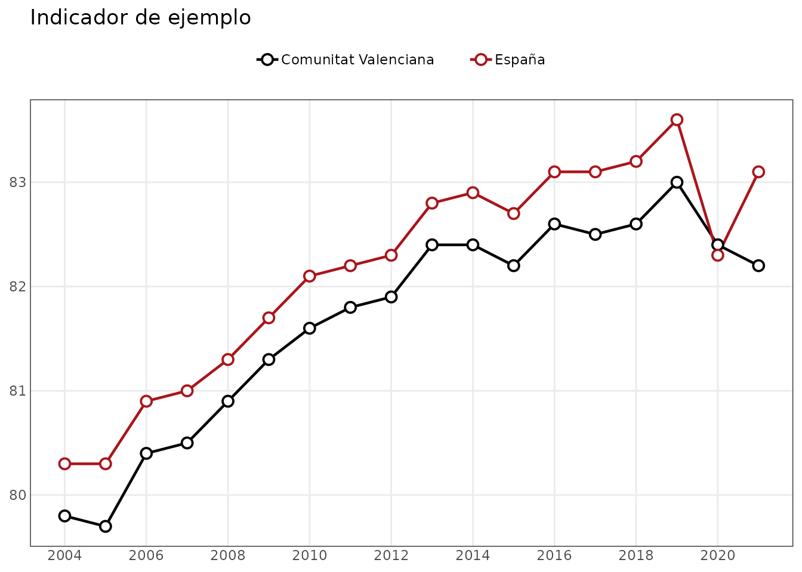
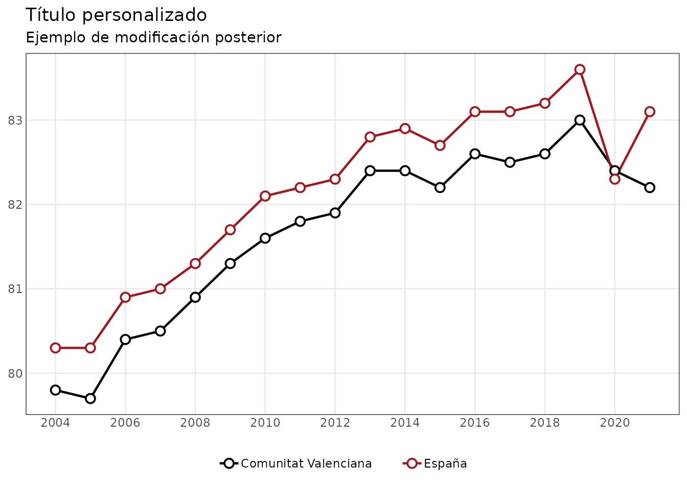

# Introducción a indicaR

## indicaR

`indicaR` facilita la consulta y visualización de una colección de
indicadores estadísticos.

El paquete ofrece dos grupos principales de funciones:

- funciones para descubrir y consultar los indicadores incluidos en el
  paquete;
- funciones de visualización basadas en `ggplot2`.

Las funciones de visualización no están ligadas a los datos internos de
`indicaR`: también pueden utilizarse con cualquier `data.frame` que
tenga la estructura necesaria.

``` r

library(indicaR)
```

## Descubrir los indicadores disponibles

La función
[`listar_indicadores()`](https://vpergim.github.io/indicaR/reference/listar_indicadores.md)
muestra los indicadores disponibles y la información básica asociada a
cada uno.

``` r

indicadores <- listar_indicadores()

head(indicadores)
#> # A tibble: 6 × 6
#>   id_dataset                    variable comentarios operacion organismo periodo
#>   <chr>                         <chr>    <chr>       <chr>     <chr>     <chr>  
#> 1 CCAA_SEXO_A_01                ESPERAN… NA          Indicado… INE       1975-2…
#> 2 CCAA_SEXO_A_02                ESPERAN… NA          Indicado… INE       1975-2…
#> 3 CCAA_SEXO_EDAD_A_01           TASA DE… En el item… Tablas d… INE       1991-2…
#> 4 CCAA_SEXO_EDAD_A_02           ESPERAN… En el item… Tablas d… INE       1991-2…
#> 5 CCAA_SEXO_EDAD_NIVELEDUCATIV… ESPERAN… NA          Indicado… INE       2016-2…
#> 6 CV_SECT1_TAMANYOEMP_A_01      EMPRESA… NA          DIRCE     INE       2020-2…
```

La columna `id_dataset` contiene el identificador que debe utilizarse en
las demás funciones de consulta.

## Consultar información sobre un indicador

[`info_indicador()`](https://vpergim.github.io/indicaR/reference/info_indicador.md)
permite conocer con más detalle el contenido de un indicador.

``` r

info_indicador("TERRITORIO_SEXO_EDAD_A_01")
#> $metadata
#> # A tibble: 1 × 7
#>   id_dataset              variable comentarios operacion organismo periodo url  
#>   <chr>                   <chr>    <chr>       <chr>     <chr>     <chr>   <chr>
#> 1 TERRITORIO_SEXO_EDAD_A… POBLACI… NA          AGENDA20… INE       2015-2… http…
#> 
#> $n_observaciones
#> [1] 880
#> 
#> $cobertura
#> $cobertura$anyo_min
#> [1] 2015
#> 
#> $cobertura$anyo_max
#> [1] 2025
#> 
#> $cobertura$frecuencia
#> [1] "A"
#> 
#> 
#> $dimensiones
#>          dimension n_valores
#> 1       territorio        20
#> 2  tipo_territorio         2
#> 3         cod_ccaa        19
#> 4             ccaa        19
#> 5    cod_provincia         0
#> 6        provincia         0
#> 7             sexo         2
#> 8             edad         2
#> 9         edad_min         2
#> 10        edad_max         2
#> 11       edad_tipo         1
```

Entre otra información, muestra:

- los metadatos del indicador;
- el número de observaciones;
- su cobertura temporal;
- las dimensiones disponibles.

## Consultar los valores de una dimensión

Antes de filtrar un indicador puede ser útil comprobar qué valores
existen en una dimensión concreta.

``` r

valores_indicador(
  "TERRITORIO_SEXO_EDAD_A_01",
  "sexo"
)
#> [1] "Hombres" "Mujeres"
```

También puede consultarse, por ejemplo, la dimensión de edad:

``` r

valores_indicador(
  "TERRITORIO_SEXO_EDAD_A_01",
  "edad"
)
#> [1] "De 15 a 24 años" "De 25 a 64 años"
```

## Obtener los datos

La función principal de acceso a los datos es
[`consultar_indicador()`](https://vpergim.github.io/indicaR/reference/consultar_indicador.md).

Por ejemplo:

``` r

datos <- consultar_indicador(
  "TERRITORIO_SEXO_EDAD_A_01",
  sexo = "Mujeres",
  edad = "De 25 a 64 años",
  tipo_territorio = "ccaa"
)

head(datos)
#> # A tibble: 6 × 21
#>   id_dataset  variable operacion organismo frecuencia territorio tipo_territorio
#>   <chr>       <chr>    <chr>     <chr>     <chr>      <chr>      <chr>          
#> 1 TERRITORIO… POBLACI… AGENDA20… INE       A          Andalucía  ccaa           
#> 2 TERRITORIO… POBLACI… AGENDA20… INE       A          Andalucía  ccaa           
#> 3 TERRITORIO… POBLACI… AGENDA20… INE       A          Andalucía  ccaa           
#> 4 TERRITORIO… POBLACI… AGENDA20… INE       A          Andalucía  ccaa           
#> 5 TERRITORIO… POBLACI… AGENDA20… INE       A          Andalucía  ccaa           
#> 6 TERRITORIO… POBLACI… AGENDA20… INE       A          Andalucía  ccaa           
#> # ℹ 14 more variables: cod_ccaa <chr>, ccaa <chr>, cod_provincia <chr>,
#> #   provincia <chr>, sexo <chr>, edad <chr>, edad_min <int>, edad_max <int>,
#> #   edad_tipo <chr>, periodo <chr>, anyo <int>, trimestre <int>, mes <int>,
#> #   valor <dbl>
```

El resultado es un `data.frame` que puede utilizarse directamente en R,
transformarse con otras herramientas o exportarse mediante las funciones
que prefiera el usuario.

## Visualizaciones

Las funciones gráficas de `indicaR` devuelven objetos `ggplot`, por lo
que el resultado puede seguir modificándose con la gramática habitual de
`ggplot2`.

### Series temporales

Para ilustrar que las funciones gráficas también admiten datos externos,
creamos un conjunto de datos sencillo:

``` r

datos_lineas <- data.frame(
  territorio = rep(
    c("Comunitat Valenciana", "España"),
    each = 18
  ),
  anyo = rep(2004:2021, times = 2),
  valor = c(
    79.8, 79.7, 80.4, 80.5, 80.9, 81.3,
    81.6, 81.8, 81.9, 82.4, 82.4, 82.2,
    82.6, 82.5, 82.6, 83.0, 82.4, 82.2,
    80.3, 80.3, 80.9, 81.0, 81.3, 81.7,
    82.1, 82.2, 82.3, 82.8, 82.9, 82.7,
    83.1, 83.1, 83.2, 83.6, 82.3, 83.1
  )
)

colores <- c(
  "Comunitat Valenciana" = "#000000",
  "España" = "#AA151B"
)

grafico_lineas(
  datos_lineas,
  grupo = "territorio",
  colores = colores,
  titulo = "Indicador de ejemplo"
)
```



## Personalizar los gráficos

Como las funciones devuelven objetos `ggplot`, pueden modificarse
después de crearlos.

``` r

p <- grafico_lineas(
  datos_lineas,
  grupo = "territorio",
  colores = colores
)

p +
  ggplot2::labs(
    title = "Título personalizado",
    subtitle = "Ejemplo de modificación posterior"
  ) +
  ggplot2::theme(
    legend.position = "bottom"
  )
```



Esta separación permite utilizar `indicaR` de dos maneras:

1.  consultar los indicadores incluidos en el paquete y representarlos;
2.  utilizar únicamente sus funciones gráficas con otros conjuntos de
    datos.

Para conocer los argumentos disponibles en cada función puede
consultarse su ayuda, por ejemplo:

``` r

?consultar_indicador
?grafico_lineas
```
