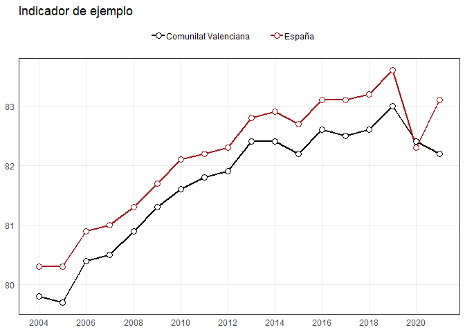
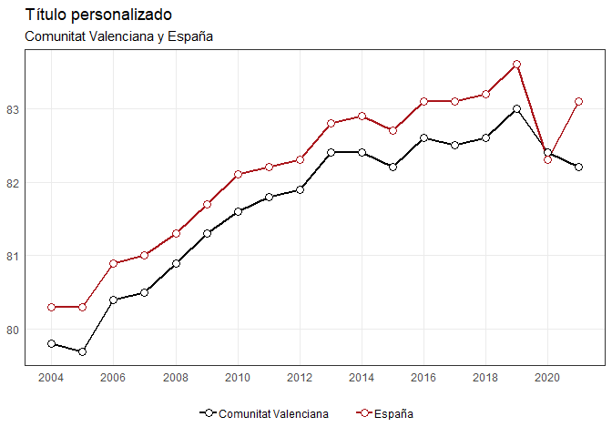

# indicaR

`indicaR` es un paquete de R para consultar y visualizar una colección
de indicadores estadísticos.

El paquete permite:

- descubrir los indicadores disponibles;
- consultar su contenido, cobertura y dimensiones;
- filtrar los datos por período, territorio y otras dimensiones;
- obtener los resultados como `data.frame`;
- generar visualizaciones mediante funciones basadas en `ggplot2`.

Las funciones de visualización también pueden utilizarse con datos
externos: no es necesario trabajar con los indicadores incluidos en
`indicaR`.

## Instalación

La versión de desarrollo puede instalarse desde GitHub:

``` r

# install.packages("pak")
pak::pak("vpergim/indicaR")
```

También puede utilizarse `remotes`:

``` r

# install.packages("remotes")
remotes::install_github("vpergim/indicaR")
```

## Consulta de indicadores

Cargamos el paquete:

``` r

library(indicaR)
```

### Indicadores disponibles

[`listar_indicadores()`](https://vpergim.github.io/indicaR/reference/listar_indicadores.md)
permite consultar el catálogo de indicadores:

``` r

indicadores <- listar_indicadores()

head(indicadores)
```

``` R
## # A tibble: 6 × 6
##   id_dataset                    variable comentarios operacion organismo periodo
##   <chr>                         <chr>    <chr>       <chr>     <chr>     <chr>  
## 1 CCAA_SEXO_A_01                ESPERAN… <NA>        Indicado… INE       1975-2…
## 2 CCAA_SEXO_A_02                ESPERAN… <NA>        Indicado… INE       1975-2…
## 3 CCAA_SEXO_EDAD_A_01           TASA DE… En el item… Tablas d… INE       1991-2…
## 4 CCAA_SEXO_EDAD_A_02           ESPERAN… En el item… Tablas d… INE       1991-2…
## 5 CCAA_SEXO_EDAD_NIVELEDUCATIV… ESPERAN… <NA>        Indicado… INE       2016-2…
## 6 CV_SECT1_TAMANYOEMP_A_01      EMPRESA… <NA>        DIRCE     INE       2020-2…
```

La columna `id_dataset` contiene el identificador utilizado por el resto
de funciones de consulta.

### Información sobre un indicador

``` r

info_indicador("TERRITORIO_SEXO_EDAD_A_01")
```

``` R
## $metadata
## # A tibble: 1 × 7
##   id_dataset              variable comentarios operacion organismo periodo url  
##   <chr>                   <chr>    <chr>       <chr>     <chr>     <chr>   <chr>
## 1 TERRITORIO_SEXO_EDAD_A… POBLACI… <NA>        AGENDA20… INE       2015-2… http…
## 
## $n_observaciones
## [1] 880
## 
## $cobertura
## $cobertura$anyo_min
## [1] 2015
## 
## $cobertura$anyo_max
## [1] 2025
## 
## $cobertura$frecuencia
## [1] "A"
## 
## 
## $dimensiones
##          dimension n_valores
## 1       territorio        20
## 2  tipo_territorio         2
## 3         cod_ccaa        19
## 4             ccaa        19
## 5    cod_provincia         0
## 6        provincia         0
## 7             sexo         2
## 8             edad         2
## 9         edad_min         2
## 10        edad_max         2
## 11       edad_tipo         1
```

La función devuelve información sobre:

- los metadatos del indicador;
- el número de observaciones;
- la cobertura temporal;
- las dimensiones disponibles.

### Valores disponibles

Antes de realizar una consulta puede comprobarse qué valores contiene
una dimensión:

``` r

valores_indicador(
  "TERRITORIO_SEXO_EDAD_A_01",
  "edad"
)
```

``` R
## [1] "De 15 a 24 años" "De 25 a 64 años"
```

### Obtener los datos

``` r

datos <- consultar_indicador(
  "TERRITORIO_SEXO_EDAD_A_01",
  sexo = "Mujeres",
  edad = "De 25 a 64 años",
  tipo_territorio = "ccaa"
)

head(datos)
```

``` R
## # A tibble: 6 × 21
##   id_dataset  variable operacion organismo frecuencia territorio tipo_territorio
##   <chr>       <chr>    <chr>     <chr>     <chr>      <chr>      <chr>          
## 1 TERRITORIO… POBLACI… AGENDA20… INE       A          Andalucía  ccaa           
## 2 TERRITORIO… POBLACI… AGENDA20… INE       A          Andalucía  ccaa           
## 3 TERRITORIO… POBLACI… AGENDA20… INE       A          Andalucía  ccaa           
## 4 TERRITORIO… POBLACI… AGENDA20… INE       A          Andalucía  ccaa           
## 5 TERRITORIO… POBLACI… AGENDA20… INE       A          Andalucía  ccaa           
## 6 TERRITORIO… POBLACI… AGENDA20… INE       A          Andalucía  ccaa           
## # ℹ 14 more variables: cod_ccaa <chr>, ccaa <chr>, cod_provincia <chr>,
## #   provincia <chr>, sexo <chr>, edad <chr>, edad_min <int>, edad_max <int>,
## #   edad_tipo <chr>, periodo <chr>, anyo <int>, trimestre <int>, mes <int>,
## #   valor <dbl>
```

[`consultar_indicador()`](https://vpergim.github.io/indicaR/reference/consultar_indicador.md)
devuelve un `data.frame` que puede utilizarse posteriormente con
cualquier herramienta de R.

## Visualización

Las funciones gráficas de `indicaR` reciben datos en formato largo y
devuelven objetos `ggplot`.

Esto permite utilizar tanto datos obtenidos mediante
[`consultar_indicador()`](https://vpergim.github.io/indicaR/reference/consultar_indicador.md)
como cualquier otro conjunto de datos compatible.

### Series temporales

Por ejemplo, podemos crear unos datos ilustrativos:

``` r

datos_ejemplo <- data.frame(
  territorio = rep(
    c("Comunitat Valenciana", "España"),
    each = 18
  ),
  anyo = rep(2004:2021, times = 2),
  valor = c(
    79.8, 79.7, 80.4, 80.5, 80.9, 81.3,
    81.6, 81.8, 81.9, 82.4, 82.4, 82.2,
    82.6, 82.5, 82.6, 83.0, 82.4, 82.2,
    80.3, 80.3, 80.9, 81.0, 81.3, 81.7,
    82.1, 82.2, 82.3, 82.8, 82.9, 82.7,
    83.1, 83.1, 83.2, 83.6, 82.3, 83.1
  )
)

colores <- c(
  "Comunitat Valenciana" = "#000000",
  "España" = "#AA151B"
)

grafico_lineas(
  datos_ejemplo,
  grupo = "territorio",
  colores = colores,
  titulo = "Indicador de ejemplo"
)
```



## Personalización

El resultado puede seguir modificándose con `ggplot2`:

``` r

p <- grafico_lineas(
  datos_ejemplo,
  grupo = "territorio",
  colores = colores
)

p +
  ggplot2::labs(
    title = "Título personalizado",
    subtitle = "Comunitat Valenciana y España"
  ) +
  ggplot2::theme(
    legend.position = "bottom"
  )
```



## Funciones principales

### Consulta de datos

- [`listar_indicadores()`](https://vpergim.github.io/indicaR/reference/listar_indicadores.md)
- [`info_indicador()`](https://vpergim.github.io/indicaR/reference/info_indicador.md)
- [`valores_indicador()`](https://vpergim.github.io/indicaR/reference/valores_indicador.md)
- [`consultar_indicador()`](https://vpergim.github.io/indicaR/reference/consultar_indicador.md)

### Visualización

- [`grafico_lineas()`](https://vpergim.github.io/indicaR/reference/grafico_lineas.md)
- [`grafico_columnas_apiladas()`](https://vpergim.github.io/indicaR/reference/grafico_columnas_apiladas.md)
- [`grafico_comparacion_territorial()`](https://vpergim.github.io/indicaR/reference/grafico_comparacion_territorial.md)
- [`grafico_mapa_ccaa()`](https://vpergim.github.io/indicaR/reference/grafico_mapa_ccaa.md)
- [`grafico_mapa_provincias()`](https://vpergim.github.io/indicaR/reference/grafico_mapa_provincias.md)

La documentación completa de cada función está disponible mediante la
ayuda de R y en el sitio web del paquete.
